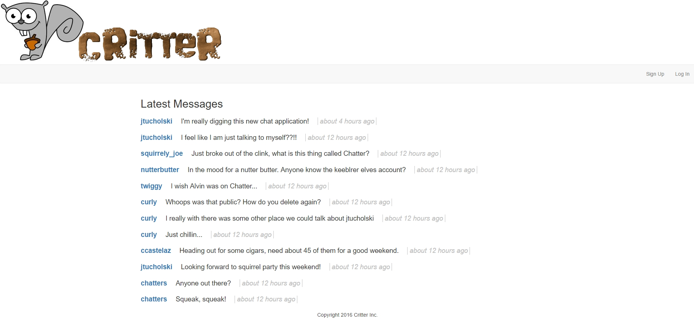

# Critter

Hello and welcome to Critter, the first real-time messaging platform. This application was created to provide a way to securely send
squeaks between two critters as well as public squeaks where you can voice your misinterpreted but well-intentioned thoughts.

## Setup

1. Create a new database called **CritterDB**

2. Run the critter.sql script against the database.

3. Make sure to update the `Initial Catalog` in your web.config file to refer to the database **CritterDB**

4. Try running!!

## Assignments

Day 1

1. SQL Injection - change SQL commands to use parameterized queries to prevent injection attacks

2. Remove any instances of the helper object "Html.Raw" which would allow text displayed to be rendered as HTML rather  that rendered as text.

Day 2

1. Implement client side validation for password strength rules - Implement multiple different custom validators, one for each rule rather than one big validator for all. This makes it easier to give the user targeted feedback about what exactly is wrong with their password. Implement server-side validation of password strength that mimics the client-side validation

2. Exercise Prevent Session Fixation - Demonstrate how a session fixation attack could be executed. Fix vulnerability by creating a new session after successful login. Demonstrate that the session fixation vulnerability no longer exists

Day 3

1. Demonstrate that Critter does not enforce access control checks

2. Implement a system that checks to make sure that the current user id in session matches the user id in the URL. This should be done using some kind of consistent method like a filter

3. If an a user attempts to do something they're not authorized for, they get a 403 error. If an unauthenticated user attempts to do something they're not authorized for, they get redirected to the login page. This is to accomodate someone who's session expired and then clicked on a link or button.

4. After authenticating, the user is redirected back to the resource of their original request. This should be implemented by passing a query string parameter to the login page in order to set up an insecure redirect

5. Build "delete message" function - Build functionality to delete a message and do it with access control
Review solution with them to make sure that they are accounting for a user's access to a particular message
